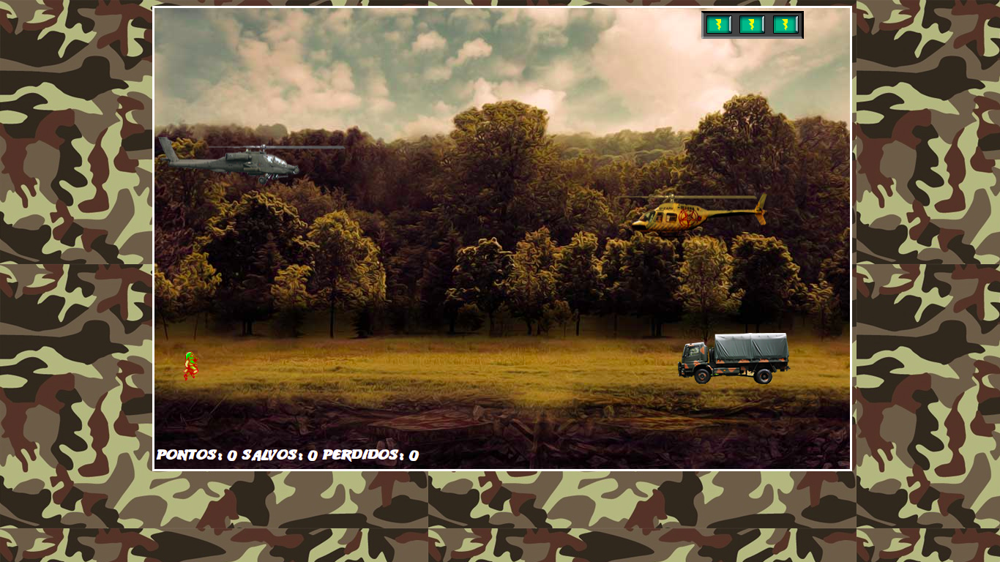

# Naves Game

A spaceship game developed during the Take Blip Web Developer Bootcamp.

## Overview

### The challenge

Users should be able to:

- Control the helicopter up and down and fire shots.
- Score by rescuing your friend.
- Enemy speed increases.
- Your loses life points when colliding with enemies.

### Screenshot

### Links

- Live Site URL: [Naves Game](https://naves-game.vercel.app/)

## My process

### Built with

- Semantic HTML5 markup
- CSS custom properties
- Jquery
- Jquery Collision

### What I learned

I used Jquery for the first time, I also had contact with Jquery Collision to detect collisions from screen objects.

## Author

- Linkedin - [William Lisboa](https://www.linkedin.com/in/william-lisboa-50340618a/)
